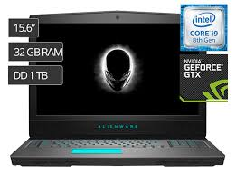

# DELL #

## Descripcion de la pagina ##
Dicha pagina es creada con el fin de mostrar las diferentes laptops en el mercado de la marca DELL.

1. Dicha pagina posee un menu el cual momento de verse en mobiles este es desplegado a la parte superior derecha .
```<div class="navbar-fixed">
        <nav class="indigo">
            <div class="nav-wrapper">
                <div class="container">
                    <a href="#" class="brand-logo">Bienvenidos a</a>
                    <a href="#" data-activates="mobile-menu" class="button-collapse"><i class="material-icons">menu</i></a>
                    <ul class="right hide-on-med-and-down">
                        <li><a href="#">Información</a></li>
                        <li><a href="#">Producto </a></li>
                        <li><a href="#">Galeria</a></li>
                        <li><a href="#">Contacto</a></li>
                    </ul>
                </div>
            </div>
        </nav>
    </div>
    <ul class="side-nav" id="mobile-menu">
        <li><a href="#">Información</a></li>
        <li><a href="#">Producto</a></li>
        <li><a href="#">Galeria</a></li>
        <li><a href="#">Contacto</a></li>
    </ul>    
```
2. luego de ellos encotramos un slider en el cual encontramos cinco difentes imajenes las cuales son alusivas a la empresa.
```
   <div class="slider">
        <ul class="slides">
            <li>
                
                <div class="caption center-align ">


                </div>
            </li>
            <li>
                
                <div class="caption left-align">
                    <h3>las mejores maquinas:</h3>
                    <h5 class="light black-text text-lighten-3">Todo tipo de laptops distribuidas a nivel Nacionales.</h5>
                </div>
            </li>
            <li>
                
                <div class="caption right-align">
                    <h3 class="blue-text">los mejores precios!</h3>
                    <h5 class="light grey-text text-lighten-3">decuentos.</h5>
                </div>
            </li>
            <li>
                
                <div class="caption center-align">
                    <h3 class="blue-text">Calidad!</h3>
                    <h5 class="light blue-text text-lighten-3">Al momento de compra cualquiera de ellas.</h5>
                </div>
            </li>
            <li>
                
                <div class="caption center-align">
                    <h3 class="darkblue-text">Mayor información!</h3>
                    <h5 class="light blue-text text-lighten-3">Les esperamos.</h5>
                    <a class="waves-effect waves-light btn blue white-text" target="_blank" href="Https://www.google.com">Buscar</a>
                </div>
            </li>
        </ul>
    </div>
```
3. Tambien encontramos una barra la cual contiene un buscador.
```
    <section class="buscar indigo light-1 white-text center">
        <div class="container">
            <div class="row">
                <div class="col s12">
                    <h3>Buscar laptops</h3>
                    <div class="inpout-field">
                        <input class="white blue-text autocomplete" placeholder="Inspiron, XPS, Alienware, serie G">
                    </div>
                </div>
            </div>
        </div>
    </section>
```
Despues encontramos unos iconos y despues de ello estan las fotos de el producto ofrecido.
```
    <section class="container">
        <div class="row center">
            <div class="col s4">
                <i class="material-icons large red-text">flash_on</i>
                <h4>Banco de carga</h4>
                <p>Contamos con las mejores baterias.</p>
            </div>
            <div class="col s4">
                <i class="material-icons">group</i>
                <h4>Conveciones</h4>
                <p>Contactanos para optenr mayor informacion.</p>
            </div>
            <div class="col s4">
                <i class="material-icons">settings</i>
                <h4>Procesadore</h4>
                <p>Intel y Amd.</p>
            </div>
        </div>
    </section>
```
4. Una galeria con los productos que ofrece la tienda al cliente en este caso se muestran los tres productos principales.
```
 <section>
        <div class="container">
            <div class="row">
                <div class="col s12 m4">
                    <div class="card">
                        <div class="card-image">
                            
                            <span class="card-title black-text"><b>Inspiron</b></span>
                        </div>

                    </div>
                </div>
            </div>
        </div>

        <div class="container">
            <div class="row">
                <div class="col s12 m4">
                    <div class="card">
                        <div class="card-image">
                            
                            <span class="card-title black-text"><b>XPS<b></span>
                        </div>

                    </div>
                </div>
            </div>
        </div>

        <div class="container">
            <div class="row">
                <div class="col s12 m4">
                    <div class="card">
                        <div class="card-image">
                            
                            <span class="card-title  black-text"><b>alienware<b></span>
                        </div>

                    </div>
                </div>
            </div>
        </div>

```
5. informacion de contacto del cliente más un comentario a la empresa en la cuel el cliente debe de ingresar su nombre y apellido, su correo y un breve mensaje seguido de un boton de enviar.
```
    <section>
        <div class="container">
            <h4 class="center indigo-text">Contacto con nosotros</h4>
            <div class="row">
                <form>
                    <div class="input-field col s12 l6">
                        <input type="text" id="primer_nombre" class="validate">
                        <label for="primer_nombre">Primer Nombre</label>
                    </div>
                    <div class="input-field col s12 l6">
                        <input type="text" id="segundo_nombre" class="validate">
                        <label for="segundo_nombre">Segundo Nombre</label>
                    </div>
                    <div class="input-field col s12">
                        <input type="email" id="email" class="validate">
                        <label for="email" data-error="Correo Inválido" data-success="Correcto">Email</label>
                    </div>
                    <div class="input-field col s12">
                        <textarea id="mensaje" class="materialize-textarea"></textarea>
                        <label for="mensaje">Mensaje</label>
                    </div>

                    <div class="col s12 center">
                        <button class="btn waves-effect waves-light blue" type="submit" name="action">Enviar
          <i class="material-icons right">send</i>
        </button>
                </form>
                </div>
            </div>
    </section>
```
6. un piede de pagina.
```
<footer class="page-footer indigo valign-wrapper center">
        <div class="container">
            <p class="flow-text white-text">&copy; 2019 DELL</p>
        </div>
    </footer>
```

## Tecnologias Usadas ##
###  
1. CSS
2. JS 
3. HTML 
4. MARKDOWN 

## Autor ##
### Mis Redes ###
* [Sigueme en mis redes](https://www.facebook.com/allan.tellez.982 "Facebook")
* [Sigueme en mis redes](https://www.instagram.com/allantellezurbina/?hl=es-la "IG")
